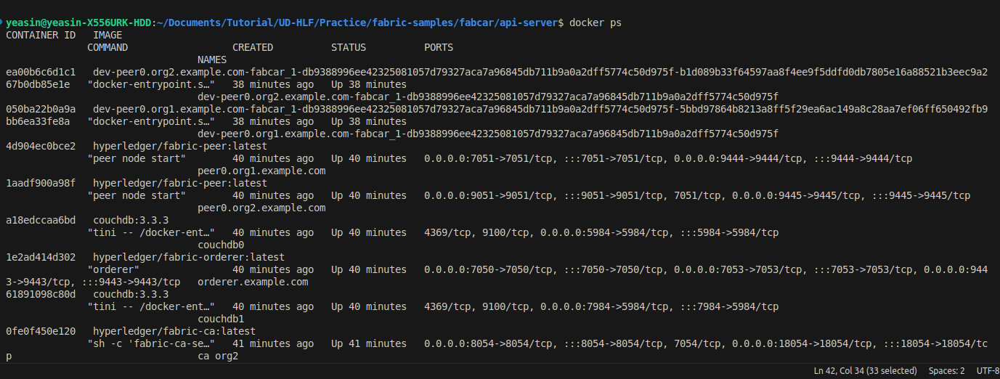

# Hyperledger Fabric Part - Application

From the last lab, we created our dev environment and used test network and interact with an application called fabcar. Today we will extend our knowledge by understanding the inner mechanism of fabcar and finally we will see how we can integrate frontend with our fabcar application. Finally we will use it from our browser.


## Let's rewind ( Prerequisites )


Before getting started, some of you may still have problems regarding the installation and setup of the environment. So we will rewind section 1 of last lab. If you already have docker installed and Hyperledger fabric fabric-samples, you can skip this step.

1.  Assuming you already have git installed in your computer. Check for the git version using the command provided below. If you do not get any version in the log you need to install git( *You can follow last lab for this step* )
```
git --version 
```
2. Now, we will install Docker and Docker Compose. But first, remove the older versions of Docker (if any) using the following commands:
```
sudo apt-get remove docker docker-engine docker.io containerd runc
```
It is okay if the above command reports that none of these packages is installed or package 'xyz..' is not installed.

3. Now, Update apt:
```
sudo apt-get update
```
4. Install packages to allow apt to use a repository over HTTPS:
```
sudo apt-get update && sudo apt-get install apt-transport-https ca-certificates gnupg-agent software-properties-common lsb-release -y
```
This may take some time to install,

5. The command below is for downloading the Docker’s official GPG key.  where **-o** defines the output path and **--dearmor** is to help convert the file into gpg format.
```
curl -fsSL https://download.docker.com/linux/ubuntu/gpg | sudo gpg --dearmor -o /usr/share/keyrings/docker-keyring.gpg
```
Don't worry if this command does not show you any response or logs in terminal. Here, **docker-keyring.gpg** is the file containing the key.

6. Use the following command to set up the stable repository and adding it to the list of package source: 
```
echo "deb [arch=$(dpkg --print-architecture) signed-by=/usr/share/keyrings/docker-keyring.gpg] https://download.docker.com/linux/ubuntu $(lsb_release -cs) stable" | sudo tee /etc/apt/sources.list.d/docker.list > /dev/null
```
This command will also don't show any response or logs in terminal.

7. Now, update the apt package again:
```
sudo apt-get update
```
This will show logs like below:


NOTE: If you a GPG error when running apt-get update run the following command: 
```shell
sudo chmod a+r /etc/apt/keyrings/docker.gpg
sudo apt-get update
```


8. Install docker :
```
sudo apt-get install docker-ce docker-ce-cli containerd.io -y
```

9. Now, to test the docker installation run: 
```
docker run hello-world
```
Don’t worry by seeing the message **“Unable to find image 'hello-world:latest' locally”**. This command initially checks if the hello-world image exists locally or not. If not found, it will be fetched from the library. 
After successfully installation you should see a message like below:


10. Next, you need to use the following commands to ensure that the user can run the docker commands with proper access privilege. 
- Add docker to user group
```
sudo groupadd docker
```  
This might report that the docker group is already added, Which is totally fine

- Now, add the current user to the docker group using:
```
sudo usermod -a -G docker $USER
```
- Finally, activate the change by:
```
newgrp docker
```

- Now, you need to rebot the PC to make the changes function properly. Therefore run the command:
```
sudo reboot
```
This will restart your machine and then again open the terminal and follow **step 9**. it should work now.

For more information on docker installation, you may visit here: [Link1](https://www.digitalocean.com/community/tutorials/how-to-install-and-use-docker-on-ubuntu-22-04), [Link2](https://docs.docker.com/engine/install/ubuntu/)

11. Download the docker-compose binary file using the command mentioned below. You can see the version that we are using is 1.29.2. If you use an older version, you may get errors in upcoming steps. Therefore you should maintain the version according to the instruction of this lab:
```
sudo curl -L https://github.com/docker/compose/releases/download/1.29.2/docker-compose-`uname -s`-`uname -m` -o /usr/local/bin/docker-compose
```
Depending on your internet, this may take time. When it is finished, you should see a response like below:


12. Make it executable using: 
```
sudo chmod +x /usr/local/bin/docker-compose
```
Dont' worry, if this command does not show any response or logs in terminal.

13. Now, check the installation: 
```
docker-compose --version
```
You should see a version like **"docker-compose version 1.29.2, build 5becea4c"**

14. Now, test the installation using the following steps:
```
mkdir hello-world
cd hello-world
nano docker-compose.yml

```
15. Now, add the following contents to the editor. After adding the following contents, press ctrl + o and then press enter to save the content. press ctrl + x to exit.  It is important to maintain indentation:
```yml
my-test:
    image: hello-world
```
16. Now run the command: 
```
docker-compose up
```
The first time we run the command, if there's no local image named hello-world, Docker Compose will pull it from the Docker Hub public repository. Then it prints a similar message like below, which indicates our docker-compose installation is complete.


17. Now, our computer is ready to install Hyperledger Fabric. But, the first step is to remove existing Fabric images, if any:
```
docker container prune
```

18. Next, copy and run the exact same command( don't remove space to make it one line sentence ).
```
cd ../
mkdir fabric
cd fabric
```
If fabric file already exist, delete and run the command again. 

19. Now, by issuing the following command we will install fabric version 2.2.2 and ca version 1.4.9
```
sudo curl -sSL http://bit.ly/2ysbOFE | bash -s -- 2.4.9 1.5.5
```
This process will take time depending on your internet speed. Once it ends, you will see responses like below. There are different versions of Fabric available. However, the 2.2 is the LTS one. It might take some time. This will create a folder called **“fabric-sample”**. Check it, you should see a lot of files inside it. These are some sample boilerplates. we only need some of them. You will learn it later in this lab. 


🤔🤔🤔 If you face difficulties to run the command, try the alternative command provided below:

```
sudo curl -sSL https://raw.githubusercontent.com/hyperledger/fabric/master/scripts/bootstrap.sh | bash -s -- 2.4.9 1.5.5
```

20. Now, if you check **fabric-samples** directory, you will see a lot of files there. However, for today's lab we will interact with the content marked in the image below:


These are the files and directories we should have.

NOTE: To learn hyperledger fabric, there are multiple sample application which is available for new learners. It is recommended for the learners that they graually explore the existing demo projects as a learning path. Fabric, uses a few binaries (in the `fabric-samples/bin` directory) to allow the developers to develop the featues provided by fabric.If you are not aware of binaries, think it is like an executable file. The **bin** folder in the above image contains the all the binaries. These binaries are used together with few configuration available in the `fabric-samples/config` directory. There are some additional configurations require for networks and organizations. Fabric architecture is complex and you need time to understand all of these. Therefore, it is suggested that you move steadily to learn hyperledger fabric.  

- **Checkpoint 1: Show this to your teacher.**
    -


## Section 1: Setting up files and folders
In this section, we will see how we can communicate with the chaincode from the browser.

1. First, download the files from https://github.com/YEASIN49/Hyperledger-Fabric-Fabcar and unzip the contents. If you want you also can clone it. To clone it open terminal and issue:
```
git clone https://github.com/YEASIN49/Hyperledger-Fabric-Fabcar.git
```
This will successfully clone the github repository and now you should have a directory called **Hyperledger-Fabric-Fabcar**. 


2. Now, go to the **Hyperledger-Fabric-Fabcar** directory and copy all contents.


These are the contents of a demo application called fabcar that we will run today.

3. Now, go to the **fabric/fabric-samples** directory and create a file called **fabcar**. Next, paste all the copied contents here.


Here, we are developing our application using javascript. Here the **chaincode-javascript** directory contains the chaincode written in javascript, **fabric-client** contains the frontend code. The **api-server** contains the rest API server, which bridges the frontend to communicate with the fabric ledger via chaincode.

4. Now, open vscode or any other text editor you use and open **fabric-samples** there.


You should have a similar window with these file in your text editor.
You are now good to go to the next section.


- **Checkpoint 2: Show this to your teacher**

## Section 2: Understanding the application setup

To run hyperledger fabric, there are some common steps: 

  i. Start a network 

  ii. Deploy chaincode to the network
  
  iii. Start and run application (frontend, backend, etc.)

**Network:** The `fabric-samples` provides preconfigured test network which helps the developer to start learning the processes. In this session, we will use the **test-network** as our network which is available in the `fabric-samples/test-network` directory. Hyperledger fabric is designed to be a consortium blockchain platform, that means multiple organizations are part of its network. The **test-network** module is pre-configured to run two organizations. One can add more organizations, but it is beyond the scope of today's session.

**Chaincode:** In ethereum, we used smart contract that enables the programming capabilities of ethereum blockchain. Similarly, Hyperledger fabric uses chaincode to executes its pragramming logic to interact with the ledger. The `fabric-samples/fabcar/chaincode-javascript` directory contains the chaincode for our application. 

**API and Frontend:** The chaincode communicates within the network to interact with the ledger. User cannot use the chaincode directly from their end. Therefore, a rest API server is required, through which the frontend communicates with the chaincode. The `fabric-samples/fabcar/api-server` contains the rest APIs and the `fabric-samples/fabcar/fabcar-client` folder holds the frontend of the system.


## Section 3: Running the complete application
In this section, you will run the complete application added with User Interface to interact from the browser. You need to follow the steps to run it. Don't worry if you don't understand anything while running the application.

### 3.1. Starting the network and Deploying the chaincode 
Fabric uses binaries and some configurations to execute its components. Usually the binaries are used through commands from terminal. However, fabric provides some bash scripts through which we can run them easily. E.g. to start the sample network, a basic terminal command is: `./network.sh up createChannel -ca -s couchdb`. There are some more commands, therefore it is required to read and understand the `fabric-samples/fabcar/startNetwork.sh`. This file calls the network module of `test-network` directory and deploy the chaincode. Also, to understand how the networks runs, you need to explore the `test-network/network.sh` file. However, this should be your own interest and we will not explore those in this session as it requires a decent time and some understanding of shell.  

Now, we will start the network. Open terminal from your code editor and go to the `fabric-samples/fabcar` directory from the terminal and run the command:
```
./startFabric.sh javascript
```

This command will invoke the `test-network` and initialize it and also it will deploy the chaincode available in the `fabcar/chaincode-javascript` directory to the fabric network.

Now, if you run the command 
```
docker ps
```

You should see the following container is running properly:




### 3.2 Running the application

1. Open a new terminal (or just move using `cd` command) and your path should be in **HERE_SOME_FOLDER/fabric/fabric-samples**. A reference is given below:


2. Go to the api-server directory inside fabcar using:
```
cd fabcar/api-server
```
3. Now, we need to install npm packages. You can find the necessary packages that we are going to install inside the package.json file. It is strongly recommended to use node version 18. To install, run:
```
npm i
``` 
After, successful installation, you should see some logs similar to image below:


4. run the command below to enroll admin to organization:
```
node enrollAdmin.js
```
You will get a similar response like below:


and then run the command to register user to organization:
```
node registerUser.js
```

This will create a user under organization (Org1). You will see a response like below:


Finally, we will power up our backend using:  

```
npm start
```
This will, start the backend service and you should see a response like below:


5. Now, leave the terminal untouched and open a new terminal from the vscode and go to the **fabcar-client** directory.
```
cd fabcar/fabcar-client/
```
6. Now, go to the, extension tab of vscode and search 'live server'. You will find a lot of options. Install the extension shown in the image:


7. Now, click the **index.html** file and start **live-server** from the  bottom-right of the vscode.


This will start our frontend server and a browser popup will open like image below:


Now, interact with the application and try to understand the features. 

You can check the currently running docker container using:
```shell
docker ps
```
You should see the status of the containers are up.In addition to  the  peers of org1, org2, orderer. Also, we have ca_org1 and ca_rg2, ca_orderer and the couchDb;3.1.1 with port 5984. This is the database, where  our state data is stored. From theory class, you should be aware of *world state* in fabric. This couchDB holds such data. Now, go to this link: http://localhost:5984/_utils/#login and you will see a login option to couchDB has appeared. default credential to access it is, ```username: admin```, ```password: adminpw```. once you are logged in, you will see a UI like below where **mychannel_fabcar** is the database we are currently using. Explore it you should see these are the same data created by initLedger function  of our chaincode.


**Checkpoint 3: Show till this part to your teacher**


To stop the network, you can use the available script. Go to the `fabric/samples/fabcar` directory from terminal window and run the command:
```
./networkDown.sh
```
This should, stop existing running hyperledger fabric test-network. After successfully shutting down the network you should see response like below:


The diagram provided below shows how the backend, frontend and chaincode maintain their communication. Here, the respective file/folder names are also included  for easier understanding. Here fabric-client  is the frontend part, api-server folder contains the backend related services and fabcar.js is the chaincode which is located in `fabcar/chaincode-javascript/lib` directory.

