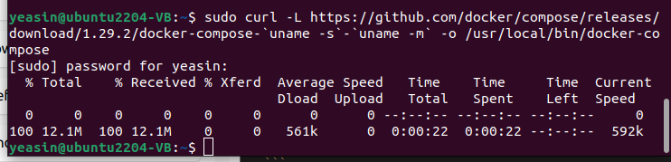

# Hyperledger Fabric Part - 2

From the last lab, we created our dev environment and used test netwrok and intereact with an aplication called fabcar. Today we will extend our knowledge by understanding the inner mechanism of fabcar and finally we will see how we can integrate frontend with our fabcar application. Finally we will use it from our browser.


### Let's rewind


Before getting started, some of you may still have problems regarding the installation and setup of the environment. So we will rewind section 1 of last lab. If you already have docker installed and Hyperledger fabric fabric-samles, you can skip this step.

1.  Assuming you already have git installed in your computer. Check for git version from below command. If you do not get any version in the log you need to install git( *You can follow last lab for this step* )
```
git --version 
```
2. Now, we will install Docker and Docker Compose. But first, remove the older versions of Docker (if any) using the following commands:
```
sudo apt-get remove docker docker-engine docker.io containerd runc
```
It is okay if the above command reports that none of these packages is installed or package 'xyz..' is not installed.

3. Now, Update apt:
```
sudo apt-get update
```
4. Install packages to allow apt to use a repository over HTTPS:
```
sudo apt-get update && sudo apt-get install apt-transport-https ca-certificates gnupg-agent software-properties-common lsb-release -y
```
This may take some time to install,

5. The command below is for downloading the Docker’s official GPG key.  where **-o** defines the output path and **--dearmor** is to help convert the file into gpg format.
```
curl -fsSL https://download.docker.com/linux/ubuntu/gpg | sudo gpg --dearmor -o /usr/share/keyrings/docker-keyring.gpg
```
Don't worry if this command does not show you any response or logs in terminal. Here, **docker-keyring.gpg** is the file containing the key.

6. Use the following command to set up the stable repository and adding it to the list of package source: 
```
echo "deb [arch=$(dpkg --print-architecture) signed-by=/usr/share/keyrings/docker-keyring.gpg] https://download.docker.com/linux/ubuntu $(lsb_release -cs) stable" | sudo tee /etc/apt/sources.list.d/docker.list > /dev/null
```
This command will also don't show any response or logs in terminal.

7. Now, update the apt package again:
```
sudo apt-get update
```
This will show logs like below:


8. Install docker :
```
sudo apt-get install docker-ce docker-ce-cli containerd.io -y
```

9. Now, to test the docker installation run: 
```
docker run hello-world
```
Don’t worry by seeing the message **“Unable to find image 'hello-world:latest' locally”**. This command initially checks if the hello-world image exists locally or not. If not found, it will be fetched from the library. 
After successfully installation you should see a message like below:


10. If you cannot run the above command and it shows the permission denied message, then you might need to use the following commands to ensure that the user can run the docker commands without being sudo. However, if the **step 9** worked, you can skip this step 10.
- Add docker to user group
```
sudo groupadd docker
```  
This might report that the docker group is already added, Which is totally fine

- Now, add the current user to the docker group using:
```
sudo usermod -a -G docker $USER
```
- Finally, activate the change by:
```
newgrp docker
```

- Now, again test the docker installation from **step 9**. If step 9 fails again, Then issue the command:
```
sudo reboot
```
This will restart your machine and then again open the terminal and follow **step 9**. it should work now.

11. Download the docker-compose binary file using the command mentioned below. You can  see the version that we are using is 1.29.2. If you use an older version, you may get errors in upcoming steps. Therefore you should maintain the version according to the instruction of this lab:
```
sudo curl -L https://github.com/docker/compose/releases/download/1.29.2/docker-compose-`uname -s`-`uname -m` -o /usr/local/bin/docker-compose
```
Depanding on your internet, this may take time. When it is finished, you should see a response like below:


12. Make it executable using: 
```
sudo chmod +x /usr/local/bin/docker-compose
```
Dont' worry, if this command does not show any response or logs in terminal.

13. Now, check the installation: 
```
docker-compose --version
```
You should see a version like **"docker-compose version 1.29.2, build 5becea4c"**